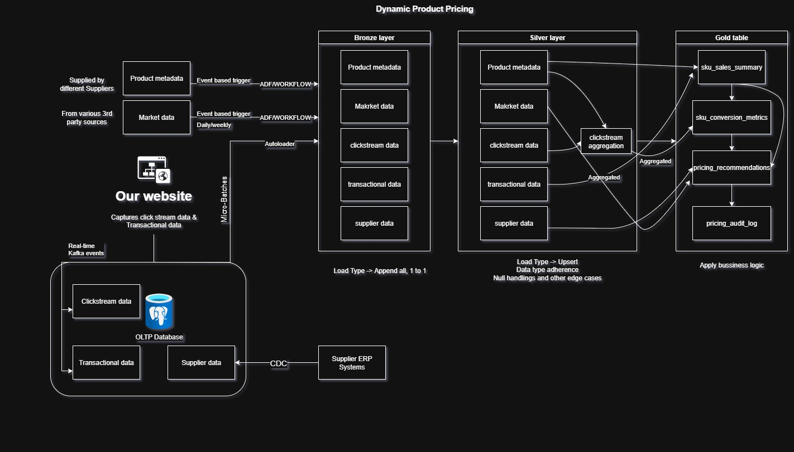

# Dynamic Product Pricing — 

## 🗂️ High-Level Architecture

Below is the high-level system design for the **Dynamic Pricing MVP**.
It shows the **data flow** from ingestion (Bronze) ➜ curation (Silver) ➜ pricing logic (Gold) ➜ final Delta output.



## ✅ Solution Summary

This prototype demonstrates a **Dynamic Product Pricing MVP** for a B2B e-commerce platform.
It ingests product sales data, computes **base cost**, identifies **anchor products** based on **gross margin value**, and generates **suggested prices** using simple rule-based logic.

Key features:
- Uses **Databricks** for scalable data processing.
- Leverages **Delta Lake** for reliable output storage.
- Implements anchor-product logic based on **greatest gross margin contribution**, not just units sold.
- Simulates cost and applies pricing uplift rules.

---

## ⚙️ Setup Instructions

1. Upload the provided `orders.csv` file to your Azure Blob Storage.
   - Example: `abfss://<container>@<storageaccount>.dfs.core.windows.net/<path>/your_orders.csv`

2. Create a new **Databricks notebook** or import this notebook directly.

3. Make sure your cluster has access to:
   - Azure Data Lake / Blob Storage (via linked service or mount point).
   - Spark version compatible with Delta Lake (runtime 10.x+ is fine).

4. Update the path in the read step if needed:
   ```python
   spark.read.option("header", True).csv("")
